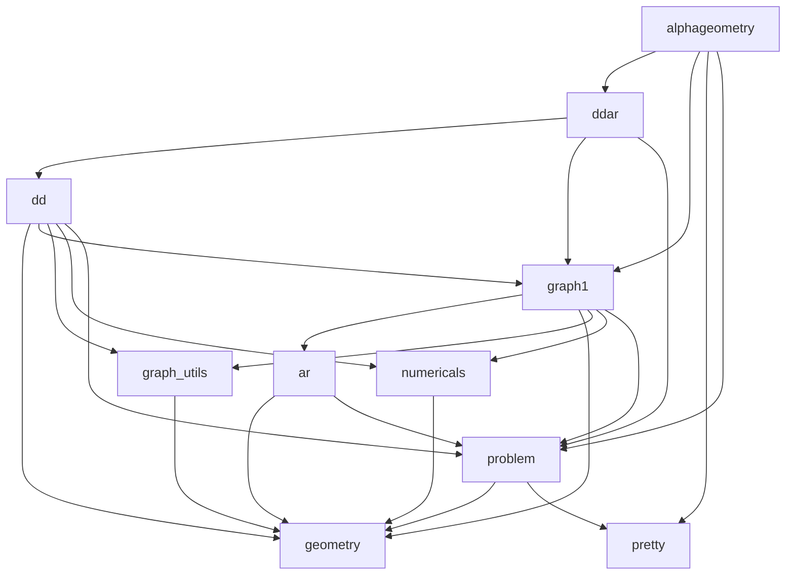

# install 
1)  
conda activate -n geo python=3.11.5
conda activate geo 

2)  install 
```
 bash install.sh
```

3) test
```
bash t1.sh 
```


# 功能分析 

## 入口
```
alphageometry ： Run DD+AR or AlphaGeometry solver.
dd:  Implements Deductive Database (DD).
ddar: Implements the combination DD+AR.
geometry : Implements geometric objects used in the graph representation
graph : Implements the graph representation of the proof state.


numericals ： Numerical representation of geometry." 
pretty : tilities for string manipulation in the DSL."""
problem : Implements objects to represent problems, theorems, proofs, traceback."""

alphageometry ：运行DD+AR或 AlphaGeometry 求解器。
dd：实现演绎数据库（DD）。
ddar：实现DD+AR的组合。
geometry：实现用于图形表示的几何对象。
graph：实现证明状态的图形表示。
numericals：几何的数值表示。 
pretty： 在DSL中用于字符串处理的工具。 
problem：实现代表问题、定理、证明和回溯的对象。 
 ```

## 依赖 


 


# 题目1参考 

https://www.zhihu.com/question/640049082/answer/3367213436

# 题目2参考

https://zhuanlan.zhihu.com/p/54158312   5题


